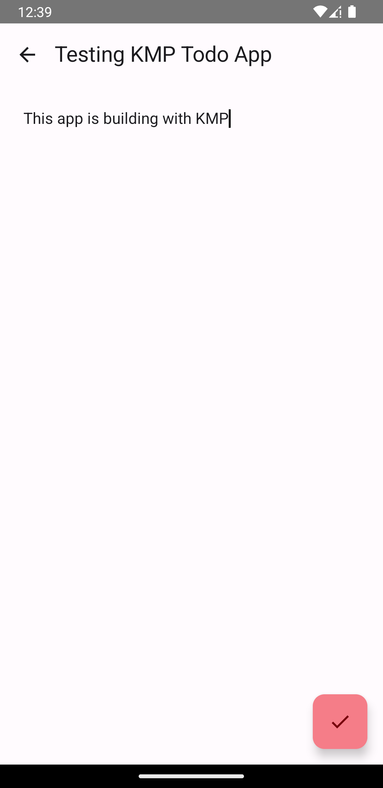
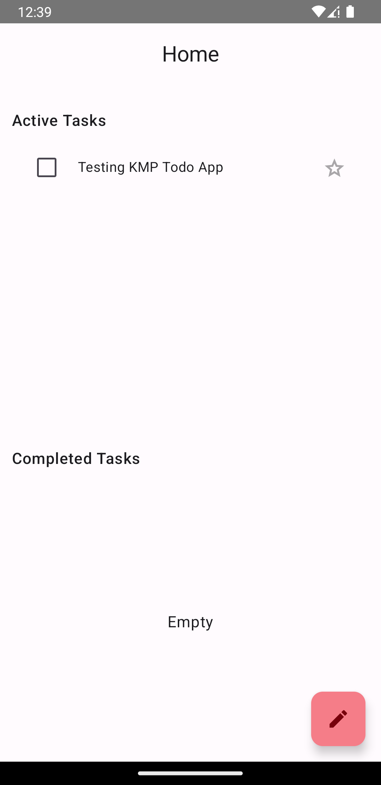

## Todo App with Kotlin Multiplatform 
- The first project with KMP frameworks
## Dependencies for App
- Compose
- Realm Database
- Voyager
- Koin
- Coroutines
- Stately

## Demo
   Android Screen | Android Screen
:-------------------------: | :-------------------------:
 | 

### Donate Me
| SHIBU | BTC | ETH | DOGE |
| :----------: | :-----------: | :-----------: | :-----------: |
|  |  |  |  |
